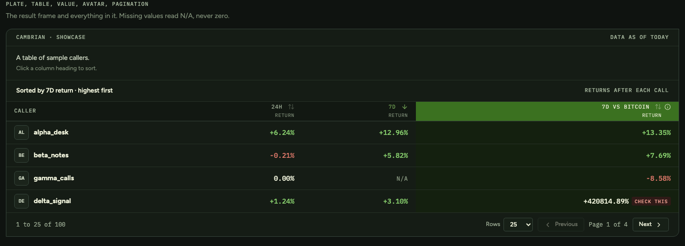

# Cambrian design system

Tokens, a base layer and React components for Cambrian's dashboards and data
tools. It is built for pages that are mostly numbers: dense tables, signed
returns, states that need explaining, and people who read them for hours.



The first thing built with it is the
[KOL leaderboard](https://github.com/cambriannetwork/KOL-Leaderboard). Everything
here was extracted from that page, so every piece has a real use behind it. When
a second product needs something new, it gets added here rather than built
twice.

## Contents

- [Using it](#using-it)
- [What is in it](#what-is-in-it)
- [Six rules](#six-rules)
- [Themes](#themes)
- [Working on the system](#working-on-the-system)
- [Changing it](#changing-it)

## Using it

Install it from GitHub at a tagged version. Pin the tag, so an update never
lands in your app without you choosing it.

```bash
npm install github:cambriannetwork/cambrian-design-system#v0.1.1
```

It also needs these in your app, which you likely have already:

```bash
npm install react react-dom @base-ui/react lucide-react
```

The package ships TypeScript source rather than a build. In Next.js, let Next
compile it:

```ts
// next.config.ts
const nextConfig = { transpilePackages: ['@cambrian/design-system'] };
export default nextConfig;
```

Import the styles once, near the root of your app, then use the components:

```tsx
import '@cambrian/design-system/styles.css';
import { Shell, ShellHeader, ShellMain, PageHeader, Button } from '@cambrian/design-system';

export default function Page() {
  return (
    <Shell>
      <ShellHeader product="Signal Ledger" />
      <ShellMain>
        <PageHeader title="Caller leaderboard" subtitle="Public-call results, ranked by Cambrian." />
        <Button onClick={() => {}}>How ranking works</Button>
      </ShellMain>
    </Shell>
  );
}
```

Your own page styles go in a stylesheet imported after `styles.css`. Read the
tokens in them rather than typing colours.

## What is in it

### Tokens

39 custom properties in [`src/tokens.css`](src/tokens.css), one value per theme.

| Group | Tokens | For |
|---|---|---|
| Surfaces | `bg`, `surface`, `surface-sunken`, `surface-raised`, `surface-control`, `surface-hover`, `row-hover`, `highlight-bg`, `scrim` | The page ground, panels, fields, hover states, the highlighted table column, and the dim layer behind a dialog |
| Ink | `ink`, `ink-soft`, `ink-muted`, `ink-faint` | Text and icons, from loudest to quietest |
| Lines | `line`, `line-strong`, `line-dotted` | Hairlines. The dark theme uses no shadows |
| Brand and action | `brand`, `brand-deep`, `on-brand`, `action` | Cambrian green, for things you can act on |
| Data | `up`, `down` | Gains and losses. Nothing else uses these colours |
| Notice | `notice-bg`, `notice-line`, `notice-ink` | The warning strip |
| Tones | `tone-positive`, `tone-caution`, `tone-neutral`, `tone-critical`, each with `-bg` and `-ink` | Badges |
| Faces | `font-serif`, `font-sans`, `font-mono` | Crimson Text, Figtree, IBM Plex Mono |
| Shape | `radius`, `radius-plate`, `row-height` | Corners, the plate's leaf corner, table rows |

Every token is prefixed `--cds-`, for example `var(--cds-ink-muted)`.

### Components

| | Component | What it does |
|---|---|---|
| Frame | `Shell`, `ShellHeader`, `ShellMain` | Page frame, top bar with the mark, and a skip link for keyboard users |
| | `PageHeader` | Page title on the brand block, a subtitle, and page actions |
| | `Logo` | The official hexagon mark |
| | `ThemeToggle`, `useTheme` | Dark and light, saved in the browser |
| Controls | `Button`, `ButtonCount`, `buttonClass` | The one button style, in two sizes |
| | `SegmentedControl` | Joined buttons where one is pressed |
| | `SearchField` | Search input with a clear button |
| | `Select` | A dropdown that always has a value |
| | `Checkbox` | Checkbox with its label |
| Overlays | `Tooltip`, `TooltipProvider` | A short note on hover or focus |
| | `Dialog` and its parts | A modal window for anything longer than a tooltip |
| | `Menu`, `MenuNote`, `MenuAction` | A small settings panel that opens from a button |
| Feedback | `Badge` | A state in one of four tones: positive, caution, neutral, critical |
| | `Chip`, `ChipGroup` | Pills that show what is filtering a list |
| | `Notice` | An inline warning or note above the content it is about |
| | `Skeleton`, `TableSkeleton` | Loading placeholders |
| | `EmptyState` | What a list shows when it has nothing |
| Data | `Plate`, `PlateIntro`, `PlateBar` | The framed result panel, with its running head |
| | `Table`, `TableScroll`, `SortHeader`, `ariaSort` | Data tables with sortable headers |
| | `Value` | A signed number: up, down, flat, missing or suspect |
| | `Avatar` | Initials or a picture |
| | `Pagination` | Range, rows per page, previous and next |

Every component has a comment at the top of its file saying when to use it.
Run the showcase to see them all at once.

## Six rules

These are the decisions that make the system hang together. A change that
breaks one of them needs a good reason, written in the pull request.

1. Use tokens only. No colour value appears anywhere except `tokens.css`. If you
   need a colour that does not exist, add a token.
2. Keep tokens on `:root`. Dialogs, menus and tooltips render in a portal on
   `<body>`, outside any wrapper. A token declared on a wrapper resolves to
   nothing there, and the popup renders with no background. This has happened.
3. Missing is not zero. A number that was not measured shows `N/A`, never
   `0`, and sorts last. `Value` does this for you when you pass `null`.
4. Show the number and flag the doubt. When a value is implausible, show it as
   received and add a badge through `Value`'s `suspect` prop. Never hide, round
   or correct it quietly.
5. Green means action. Cambrian green marks what you can click. Up and down
   have their own colours, and nothing else uses those.
6. Write plain English with no em dashes: in components, in their default
   text, and in these docs.

## Themes

Dark is the default. Put `data-theme="light"` on `<html>` for light. `useTheme`
does that and remembers the choice:

```tsx
const [theme, setTheme] = useTheme();
return <ThemeToggle theme={theme} onChange={setTheme} />;
```

`useTheme` saves to `localStorage` under `cds-theme`. Pass
`useTheme({ storageKey })` to keep an older key, so visitors keep their choice.

## Working on the system

```bash
npm install
npm run dev          # the showcase at http://localhost:5174
npm run check        # typecheck, lint, build and the visual tests
```

The showcase in [`showcase/`](showcase) renders every token and component. Use it
while you work. It is also what the visual tests photograph.

### Visual tests

`npm run test:visual` renders the showcase in both themes, opens the dialog,
menu, select and tooltip, and compares each against the reference screenshots in
[`tests/visual.spec.ts-snapshots`](tests/visual.spec.ts-snapshots). A change
that moves a single pixel fails the run.

When you meant to change how something looks, run
`npm run test:visual:update`, open the new images and check them, then commit
them with your change. The reviewer sees exactly what moved.

Fonts render slightly differently on each operating system, so references are
stored per platform. The ones here were recorded on macOS.

## Changing it

[CONTRIBUTING.md](CONTRIBUTING.md) walks through adding a token, adding a
component and cutting a release. [CHANGELOG.md](CHANGELOG.md) lists every
release.

## Credits

The reset in `src/base.css` is the Tailwind CSS v4 preflight, used under the MIT
License. See [THIRD-PARTY-NOTICES.md](THIRD-PARTY-NOTICES.md). Tailwind itself is
not a dependency.
